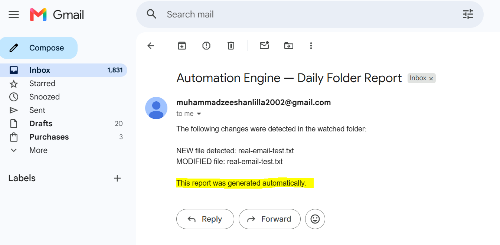
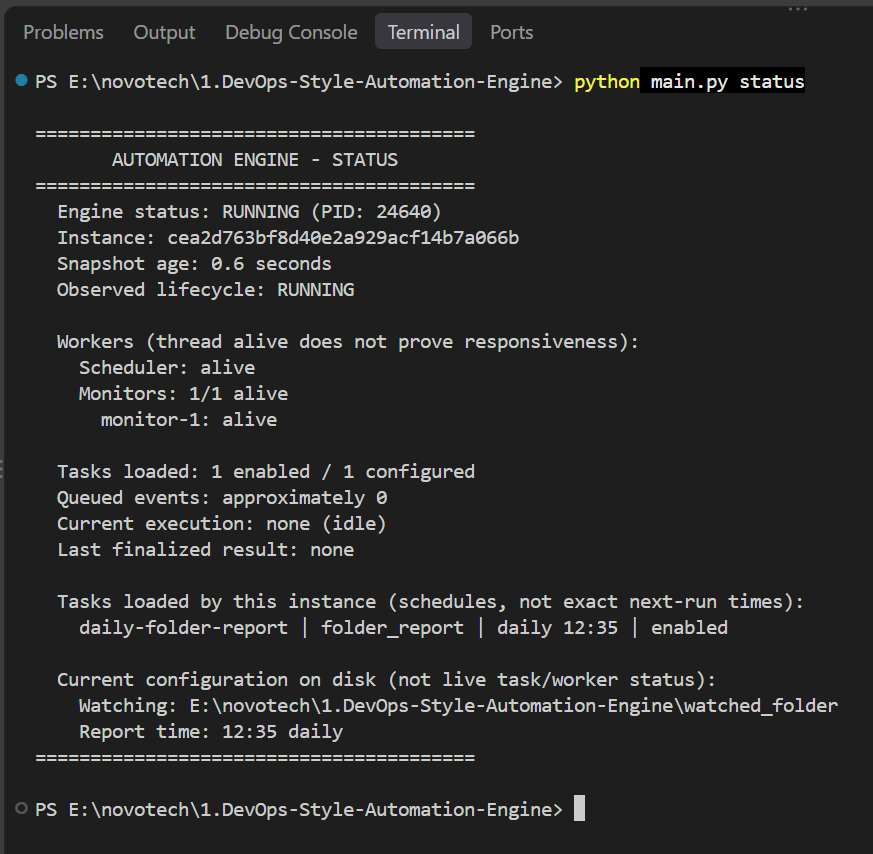

# DevOps-Style Automation Engine

> A configuration-driven CLI automation engine built with Python for task scheduling, folder monitoring, automated email delivery, report generation, logging, and safe runtime control.


---

## Overview

The **DevOps-Style Automation Engine** automates repetitive operational tasks from the command line.

Instead of changing Python code every time you want a new workflow, tasks can be configured through JSON.

The engine can:

- monitor folders for file changes
- execute tasks on a daily schedule
- execute tasks every X minutes
- trigger tasks from file events
- generate folder-change reports
- send automated emails
- maintain runtime logs
- safely start, stop, and report engine status

The project is built using the **Python standard library** and does not require a third-party framework.

---

## Demo

### Real Automated Email Report



The engine detected changes inside the watched folder, generated the report automatically, and delivered it through SMTP.

### Live Engine Status



---

## How It Works

```text
JSON Configuration
        │
        ▼
Automation Engine
        │
        ├── Scheduler
        │      ├── Daily tasks
        │      └── Interval tasks
        │
        └── File Monitor
               └── File-event tasks
                        │
                        ▼
                    Task Runner
                        │
                ┌───────┴────────┐
                ▼                ▼
          Email Handler    Folder Report
                │                │
                └───────┬────────┘
                        ▼
                 Logs + Status
```

---

## Main Features

### Task Scheduling

Run automation tasks:

- daily at a configured time
- every X minutes
- when selected file events occur

### Folder Monitoring

The engine can detect:

- new files
- modified files
- deleted files

### Email Automation

SMTP email tasks can be configured using JSON.

SMTP passwords are not stored inside the source code.

### Folder Reports

Changes detected inside a watched folder can be collected and sent automatically as a report.

### Runtime Control

The CLI provides:

```text
start
status
stop
```

The engine also prevents multiple instances from owning the same project runtime.

### Logging

Important runtime activity is recorded, including:

```text
Task started
Task completed
Task failed
Task skipped
File detected
Engine started
Engine stopped
```

---

# Quick Start

## 1. Clone the Repository

```bash
git clone https://github.com/muhammadzeeshanlilla/1.DevOps-Style-Automation-Engine.git
```

Enter the CLI version:

```bash
cd 1.DevOps-Style-Automation-Engine/1.CLI-Version
```

---

## 2. Check Python

Python **3.9 or newer** is required.

```bash
python --version
```

No `pip install` is required because the project uses Python standard-library modules.

---

## 3. Review Configuration

Open:

```text
config/settings.json
```

The included configuration should contain safe example values.

Example:

```json
{
  "watch_folder": "watched_folder",
  "email": {
    "sender": "sender@example.com",
    "receiver": "receiver@example.com",
    "smtp_server": "smtp.gmail.com",
    "smtp_port": 587
  },
  "schedule": {
    "hour": 12,
    "minute": 35
  }
}
```

You can also explore the multi-task configuration example:

```text
config/settings.tasks.example.json
```

---

# Run the Engine

## Check Status

```bash
python main.py status
```

Example:

```text
========================================
       AUTOMATION ENGINE - STATUS
========================================
  Engine status: STOPPED
  No engine instance owns the project lock.
========================================
```

---

## Start

```bash
python main.py start
```

Keep this terminal open while the engine is running.

Example:

```text
=== Automation Engine STARTING ===
File monitor started.
Scheduler started with configured daily/interval tasks.
=== Automation Engine STARTED ===

Engine is running. Press Ctrl+C to stop.
```

---

## Check Live Status

Open another terminal in the same project folder:

```bash
python main.py status
```

---

## Stop

From another terminal:

```bash
python main.py stop
```

The engine performs a cooperative shutdown and releases runtime ownership safely.

---

# Try File Monitoring

Start the engine:

```bash
python main.py start
```

Then create a file inside:

```text
watched_folder/
```

For example:

```text
watched_folder/demo.txt
```

Add some text and save it.

After the next monitoring cycle you should see output similar to:

```text
NEW file detected: demo.txt
```

Modify the file:

```text
MODIFIED file: demo.txt
```

Delete it:

```text
DELETED file: demo.txt
```

---

# Test Real Email Delivery

Real email delivery is optional.

For Gmail SMTP, update the sender and receiver values in:

```text
config/settings.json
```

Example:

```json
"sender": "your-email@gmail.com",
"receiver": "receiver@gmail.com",
"smtp_server": "smtp.gmail.com",
"smtp_port": 587
```

Do **not** put your Gmail password or App Password inside the JSON file.

Set the password as an environment variable.

### PowerShell

```powershell
$smtpPasswordInput = Read-Host "SMTP App Password" -AsSecureString
$env:SMTP_PASSWORD = [System.Net.NetworkCredential]::new("", $smtpPasswordInput).Password
Remove-Variable smtpPasswordInput
```

Then start the engine from the same PowerShell session:

```powershell
python main.py start
```

When the configured task runs, successful SMTP acceptance appears similar to:

```text
SMTP accepted email to receiver@example.com
Task completed
```

> For Gmail, use a Google App Password instead of your normal Gmail account password.

---

# Run Automated Tests

The project includes a complete automated test suite.

Run:

```bash
python -B -m unittest discover -s tests
```

Final verified result:

```text
Ran 406 tests

OK
```

Some tests intentionally simulate failures such as:

```text
Task failed
Lifecycle notification failed
controlled failure
```

These messages are part of negative/error-handling tests.

If the test run finishes with:

```text
OK
```

the test suite passed.

---

## Project Structure

```text
1.CLI-Version/
│
├── cli/
│   └── handler.py
│
├── config/
│   ├── loader.py
│   ├── settings.json
│   ├── settings.example.json
│   └── settings.tasks.example.json
│
├── scheduler/
│   └── job_scheduler.py
│
├── tasks/
│   ├── email_action.py
│   ├── email_task.py
│   ├── event_dispatcher.py
│   ├── events.py
│   ├── file_monitor.py
│   ├── models.py
│   ├── notifications.py
│   ├── registry.py
│   ├── report_task.py
│   └── runner.py
│
├── utils/
│   ├── logger.py
│   ├── paths.py
│   ├── process_manager.py
│   └── runtime_status.py
│
├── tests/
│
├── watched_folder/
│
├── docs/
│   └── screenshots/
│
├── main.py
├── README.md
├── DOCUMENTATION.md
└── .gitignore
```

---

## Screenshots

Additional runtime evidence is available in:

```text
docs/screenshots/final/
```

It includes:

- stopped engine status
- engine startup
- live runtime status
- duplicate-start protection
- new/modified/deleted file detection
- interval task execution
- daily task execution
- file-event task execution
- cooperative shutdown
- runtime logs
- successful real email delivery

---

## Full Technical Documentation

This README is intentionally focused on the project overview, setup, usage, and testing.

For deeper technical information such as configuration schema, scheduler behavior, file-event dispatching, process ownership, SMTP behavior, lifecycle notifications, runtime status internals, architecture details, and known limitations, see:

**[DOCUMENTATION.md](DOCUMENTATION.md)**

---

## CLI Version Status

**Completed**

- Core automation engine implemented
- Manual runtime testing completed
- Real SMTP email delivery verified
- 406 automated tests passing
- CLI version ready for use

---

## Next Version

A separate full-stack version of this project will extend the automation engine with a graphical frontend and API while keeping this CLI implementation as the completed standalone version.

---

## Author

**Muhammad Zeeshan**

GitHub: [muhammadzeeshanlilla](https://github.com/muhammadzeeshanlilla)
