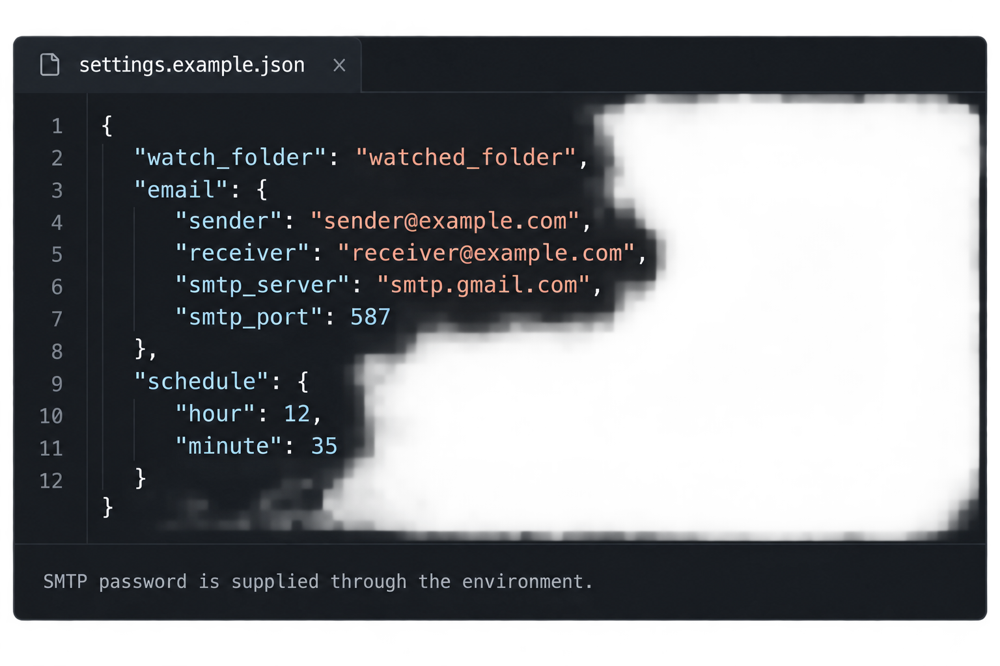

# Automation Engine — Inline Documentation

**Project:** DevOps-Style Automation Engine  
**Developer:** Muhammad Zeeshan  
**Version:** 1.0  
**Language:** Python 3.9 or newer  

---

## Current final verification and presentation

**Copied FullStack backend API Phase 1:** a separate FastAPI package now wraps the unchanged CLI engine. See [API_README.md](API_README.md) for dependencies, local launch commands, safe endpoint contracts and the 63 separate API tests. The 406-test CLI baseline and the historical CLI documentation below are preserved. No frontend, authentication, database or task-writing API has been added.

The completed CLI version covers all eight core internship requirements: start/stop/live status, JSON-configured multiple tasks, daily and interval scheduling, new/modified/deleted monitoring and configured event execution, task lifecycle logging, SMTP actions with opt-in completion/failure notifications, cooperative background workers and modular structure.

**Current result: 406 passing tests and 40 Python files passing AST syntax checks.** SMTP is mocked; no real SMTP/network connection is used. Both configuration examples validate. Runtime source behavior and local settings remain unchanged by submission cleanup. Python 3.9+ is required; final verification ran on Windows/Python 3.14.7, not every supported version or a real Unix host.

README's Final architecture section and section 10 below describe the current runtime. Phase-specific notes and intermediate test totals later in this document are **historical development milestones**, not competing final results. Historical protected-file statements apply only to their named milestone.

All six existing screenshots and the linked demo predate the final runtime, except that setting.png is a sanitized configuration illustration. start.png, modified.png, log.png and status.png show historical behavior; engine_start.png shows an older repository with runtime artifacts. They are not final runtime captures. No terminal evidence was fabricated. Replace these manually with current start, detection, logs and running live status; add stopped status and cooperative stop. Exclude secrets, bodies and unnecessary private paths. See README for safe no-SMTP verification and the pre-publish checklist. Git history was not inspectable because this workspace is not a Git repository.

## Table of Contents

1. [Project Overview](#1-project-overview)
2. [Folder Structure](#2-folder-structure)
3. [main.py](#3-mainpy)
4. [config/settings.json](#4-configsettingsjson)
5. [utils/logger.py](#5-utilsloggerpy)
6. [tasks/file_monitor.py](#6-tasksfile_monitorpy)
7. [tasks/email_task.py](#7-tasksemail_taskpy)
8. [scheduler/job_scheduler.py](#8-schedulerjob_schedulerpy)
9. [cli/handler.py](#9-clihandlerpy)
10. [How All Files Connect Together](#10-how-all-files-connect-together)
11. [Data Flow — Step by Step](#11-data-flow--step-by-step)
12. [Error Handling](#12-error-handling)
13. [Threading Explained](#13-threading-explained)

---

## 1. Project Overview

This project is a **command-line based automation engine** built entirely in pure Python.

**What problem does it solve?**

In many companies, a manager needs to know every time someone adds, edits, or deletes a file in an important folder. Checking this manually every day wastes time and causes human errors.

**How does this engine solve it?**

The monitor and scheduler run in background threads while the foreground engine process stays open. It watches a specific folder every 5 seconds. At a scheduled time — for example 9:00 AM every day — it automatically sends a complete report email to the boss listing every change that happened in the folder. Nobody needs to press any button or type any command. Everything is automatic.

**Key design decisions:**

| Decision | Reason |
|---|---|
| Pure Python only | Teacher requirement — no heavy frameworks |
| JSON config file | User changes ordinary settings without touching code; SMTP_PASSWORD supplies the secret |
| Threading | File monitor and scheduler run at the same time without blocking each other |
| Modular structure | Each responsibility is separated into its own file |
| Instance lock and metadata | Shared, project-root cooperative CLI process control; recorded PIDs are not signal targets |

---

## 2. Folder Structure

```text
automation-engine/
  main.py
  config/
    loader.py
    settings.json                 # Local settings; ignored, unchanged
    settings.example.json         # Legacy template
    settings.tasks.example.json   # Version-2 template
  cli/handler.py
  scheduler/job_scheduler.py
  tasks/
    models.py
    events.py
    event_dispatcher.py
    registry.py
    runner.py
    notifications.py
    report_task.py
    email_action.py
    file_monitor.py
    email_task.py
  utils/
    paths.py
    logger.py
    process_manager.py
    runtime_status.py
  tests/
  docs/screenshots/
  watched_folder/
  logs/engine.log                  # Runtime
  engine.lock                     # Runtime ownership lock
  engine.pid                      # Runtime JSON ownership metadata
  engine.status.json              # Runtime observation snapshot
  engine.stop.<instance_id>       # Runtime stop request
  .gitignore
  README.md
  DOCUMENTATION.md
```

**What is `__init__.py`?**

`__init__.py` commonly marks and initializes a regular Python package. This project uses it to make package boundaries explicit. It may be empty, or it may contain package initialization code. Python also supports namespace packages without this file, so its absence does not always prevent imports.

---

## 3. main.py

`main.py` remains the entry point and `Engine` remains the component coordinator. The command names are unchanged:

```powershell
python main.py start
python main.py status
python main.py stop
```

### Command dispatch

When run directly, the entry block initializes the existing logger and calls `run_cli()`. Importing this module no longer initializes file logging. `run_cli()` loads workflow configuration and constructs an Engine only for start. Status, stop and invalid-command help do not require a valid workflow configuration or create worker components.

`load_config()` calls config.loader.load_config(CONFIG_PATH). Legacy and version-2 JSON normalize to the same read-only WorkflowConfiguration. Relative paths are resolved from the project root. Engine builds TaskRegistry and TaskRunner, one monitor per distinct enabled report/event folder, and one scheduler. Scheduled-email-only workflows create no monitors. File-event email workflows create their required monitors and use the shared scheduler worker.

### Engine.start()

1. Acquire ownership using ProcessManager. A competing start exits with code 1.
2. Publish STARTING metadata and initialize the local lifecycle flags.
3. Start all required monitors before the single scheduler, recording each attempt so partial starts also receive cleanup.
4. Publish RUNNING after all required start methods return.
5. Keep the foreground process alive, checking the current instance's stop request about once per second.
6. On stop request, Ctrl+C, startup exception or runtime exception, enter the shared finally cleanup path.

### Engine.stop()

Set the local running flag false, wake the main wait, and publish STOPPING. A cleanup lock serializes repeated/concurrent cleanup calls. Signal every component whose start was attempted before waiting for any worker. This includes a component whose startup only partially succeeded.

Each component stop/join waits for at most one second per call. Afterward the engine checks actual thread liveness. If a worker is still alive, it logs a warning and continues bounded waits, retaining ownership. A stop, join or liveness-check error is logged without skipping other components. Unknown worker liveness is treated conservatively as unfinished cleanup. Shutdown signals are retried for unfinished workers, with a short pause to prevent a busy error loop. Repeated Ctrl+C during a component wait is handled without skipping the remaining cleanup.

Only after all attempted workers exit does `_cleanup_done` become True. The start method's finally block then removes owned runtime state and releases the lock. Repeated completed cleanup returns the saved result. Startup/runtime/cleanup errors produce exit code 1; a successfully cleaned Ctrl+C exits with code 0.

Synchronous SMTP can delay shutdown while an operation is in progress, even with its explicit socket timeout. Filesystem operations can also block. Individual joins are bounded, but total shutdown time is not. The CLI stop command still waits up to five seconds and can report unconfirmed shutdown while the original engine keeps waiting. Pending in-memory events are not saved. If publishing STOPPING fails, ownership is still retained but metadata can show the previous state.

### utils/process_manager.py

ProcessManager centralizes the functions previously duplicated between main.py and cli/handler.py. It uses no process signals and never treats a recorded PID as a safe termination target.

- `acquire()`: obtain an exclusive OS lock, reject legacy numeric PID files, and atomically publish a new STARTING record.
- `publish_state()`: write lifecycle metadata through a temporary file and atomic replacement while owning the lock.
- `inspect_status()`: probe ownership and read validated metadata. Missing metadata with a held lock triggers a bounded ownership recheck; confirmed ended ownership is STOPPED. Persistent missing/malformed data or permission errors remain UNKNOWN. Legacy numeric files remain LEGACY.
- `request_stop()`: validate the target and create its instance-specific request, then confirm ownership release. After safe targeting, temporary UNKNOWN polls are tolerated until the overall timeout. Initial validation, filesystem retries and polling share the five-second budget. Repeated requests are harmless; timeout includes the last uncertainty and never causes forced termination.
- `stop_requested()`: check only the owning instance's request. Requests for other instance IDs are ignored.
- `release()`: delete metadata only when its instance ID matches the owner, remove that owner's stop request, and release the lock even if file cleanup fails.

`engine.lock` uses a nonblocking one-byte lock through msvcrt on Windows, or fcntl.flock on Unix. The lock file remains on disk so all commands lock the same file. Its existence is not evidence that the engine is running.

`engine.pid` is now JSON runtime metadata containing version, PID, instance_id, state and started_at. PIDs are informational. Stop requests use engine.stop.<instance_id>; identifiers are validated before forming paths.

Unlocked modern/malformed metadata can be replaced by a new start after ownership is acquired. Status leaves that stale record intact and explains it. Legacy plain-number PID files are preserved and reported as LEGACY: stop the old engine with Ctrl+C and confirm it has exited before removing that file. Old stop requests do not affect a later instance.

All runtime paths are project-root paths. The alternate runtime directory accepted by ProcessManager is for isolated tests, not a workflow setting. Windows file locks and controlled CLI subprocesses were exercised; Unix locking calls were mocked and still need real-host verification.

### Bounded Windows contention handling

`_retry_file_operation()` retries Win32 access/sharing codes 5, 32 and 33 only on Windows. Windows CRT-backed file opening may report errno EACCES without winerror, which is also retried on Windows. Access denied can represent either temporary sharing or permanent permissions; a deadline prevents hiding permanent failure. Other error codes and Unix filesystem errors are not given Windows retries.

Each file operation has a one-second retry budget and 10-millisecond delays capped by remaining time. A caller deadline can shorten that budget. Metadata reads reopen and close within each attempt. Replacement retries reuse the same fully written, closed temporary file; the old record remains intact if replacement fails. Runtime metadata, stop requests and temporary-file deletion use the same bounded policy. If temporary cleanup also fails, the publication error remains primary and cleanup is retained as its cause.

`inspect_status()` re-probes the ownership lock when metadata is missing, for up to 100 milliseconds or the caller's earlier deadline. It never infers shutdown solely from a missing file. The ownership probe, atomic metadata publication, validation rules and instance IDs remain the existing design.

Stress testing also reproduced an idle status probe temporarily holding the ownership lock while a new engine attempted acquisition. `acquire()` now retries lock contention for up to 100 milliseconds. This retains the same exclusive-lock ownership requirement and rejects a persistent competing owner without touching its metadata. A missing metadata read receives one immediate fresh ownership probe even if the waiting deadline has expired; any subsequent sleeps remain bounded.

After a valid stop request, UNKNOWN may describe the short gap between metadata deletion and unlock. Confirmation now continues polling instead of reporting immediate failure. It reports success only on confirmed ended ownership or a validated replacement instance. Legacy metadata still stops unsafe control. Timeout returns REQUESTED with a non-success CLI code and useful uncertainty details.

Persistent external handles or denied permissions can exceed the budget. Lifecycle publication can then fail visibly, and cleanup may leave recoverable modern stale metadata while releasing the lock in finally. OS calls and scheduling are not hard real-time; application retries are bounded. Synchronous SMTP waits and memory-only events remain separate limitations.

---

## 4. config/settings.json

SMTP is configurable. Gmail and smtp.gmail.com:587 are examples, not mandatory requirements. The server must support STARTTLS with a trusted hostname-matching certificate and sender/password authentication. Implicit TLS-only SMTP is not implemented. SMTP_PASSWORD remains environment-only.

**Purpose:** Store ordinary watched-folder, email and schedule settings. The engine reads local `settings.json`; `settings.example.json` is the safe template. SMTP_PASSWORD provides the password separately.


`config/settings.example.json` is a safe, secret-free template. The engine reads your local `config/settings.json`, which Git ignores. From the project directory, create the local file **only if it does not already exist**, then edit its ordinary settings.

PowerShell:

```powershell
if (-not (Test-Path -LiteralPath config/settings.json)) {
    Copy-Item -LiteralPath config/settings.example.json -Destination config/settings.json
}
```

Bash:

```bash
if [ ! -f config/settings.json ]; then
    cp config/settings.example.json config/settings.json
fi
```



The illustration contains example values; it is not a live execution screenshot.

```json
{
  "watch_folder": "watched_folder",
  "email": {
    "sender": "sender@example.com",
    "receiver": "receiver@example.com",
    "smtp_server": "smtp.gmail.com",
    "smtp_port": 587
  },
  "schedule": {
    "hour": 12,
    "minute": 35
  }
}
```

**What each field means:**

| Field | What to write | Example |
|---|---|---|
| `watch_folder` | Project-relative or absolute folder path | `watched_folder` |
| `sender` | Your SMTP sender address (Gmail is one example) | `myemail@gmail.com` |
| `receiver` | Boss email address | `boss@company.com` |
| `smtp_server` | Configured STARTTLS SMTP server (Gmail example) | `smtp.gmail.com` |
| `smtp_port` | Configured SMTP port (Gmail example) | `587` |
| `hour` | Hour to send report (24-hour format) | `9` means 9:00 AM |
| `minute` | Minute to send report | `0` means :00 |

Relative watched-folder paths are resolved from the project root, the directory containing `main.py`, rather than from the terminal directory. Absolute paths on the current operating system are preserved. Both configuration readers use this rule. Configuration always comes from the project’s `config/settings.json`; logs always go to the project’s `logs/engine.log`.

**Set the SMTP password separately**

An environment variable is a named value inherited by a program from its launcher. Set `SMTP_PASSWORD` before starting the engine, in that same terminal. These prompts avoid putting the password directly in command history.

PowerShell:

```powershell
$smtpPasswordInput = Read-Host 'SMTP app password' -AsSecureString
$env:SMTP_PASSWORD = [System.Net.NetworkCredential]::new('', $smtpPasswordInput).Password
Remove-Variable smtpPasswordInput
```

Bash:

```bash
read -r -s -p "SMTP app password: " SMTP_PASSWORD
printf '\n'
export SMTP_PASSWORD
```

These values apply to the current terminal and programs started from it. A new terminal needs its own setup. If `SMTP_PASSWORD` is missing or empty when an email is attempted, the program logs a clear error and returns without connecting to SMTP. It does not print the password or read a password from JSON. The password is also redacted from SMTP exception messages.

A `.env` file is plaintext storage for environment-style values. This project does **not** load `.env` files automatically and adds no loader or dependency. Creating one alone will not set `SMTP_PASSWORD`. `.gitignore` excludes `.env` files and local settings; ignore rules do not remove previously tracked copies from Git history.

**Schedule time examples:**

| You want | hour | minute |
|---|---|---|
| 9:00 AM | `9` | `0` |
| 2:30 PM | `14` | `30` |
| 11:45 AM | `11` | `45` |

---

### utils/paths.py

This utility locates the project from its own file location. The project root is the directory containing `main.py`. Configuration and log paths are built from that root, so they do not change when the terminal directory changes.

```python
"""Stable project paths, independent of the terminal's working directory."""

from pathlib import Path


PROJECT_ROOT = Path(__file__).resolve().parent.parent
CONFIG_PATH = PROJECT_ROOT / "config" / "settings.json"
LOG_DIR = PROJECT_ROOT / "logs"
LOG_FILE = LOG_DIR / "engine.log"
ENGINE_LOCK_PATH = PROJECT_ROOT / "engine.lock"
ENGINE_PID_PATH = PROJECT_ROOT / "engine.pid"
STOP_REQUEST_DIR = PROJECT_ROOT
STOP_REQUEST_PREFIX = "engine.stop."


def resolve_project_path(path):
    """Resolve a relative path from the project root; keep absolute paths."""
    configured_path = Path(path)
    if configured_path.is_absolute():
        return configured_path
    return (PROJECT_ROOT / configured_path).resolve()
```

`main.load_config()` and `cli.handler.load_config_for_status()` use the same configuration path and watched-folder resolver. The resolver preserves absolute paths on the current operating system. A relative value such as `watched_folder` becomes the project's watched-folder path. Process runtime paths also come from this module; PID, lock and stop-request paths no longer depend on the terminal directory.

The four ordinary email fields remain `sender`, `receiver`, `smtp_server`, and `smtp_port`. JSON contains no password field. Never put SMTP_PASSWORD into examples or screenshots.

---

## 5. utils/logger.py

**Purpose:** Uses `LOG_DIR` and `LOG_FILE` from `utils.paths` to write inside the project, regardless of the terminal directory. Appending, levels, timestamps and console output are unchanged. Provides a logging system used by every other file in the project. Every time something happens — task started, file detected, email sent, error occurred — every file calls the logger to record it.

**Why a separate logger file?**

Without this, every file would need to set up logging individually. With this file, any file in the project just does:
```python
from utils.logger import get_logger
logger = get_logger()
logger.info("Something happened")
```
One line. Consistent format. No repetition.

```python
import logging  # Python's built-in logging library
import os       # To create the logs/ folder if it does not exist
from utils.paths import LOG_DIR, LOG_FILE

def setup_logger():
    # Create logs/ folder automatically if it does not exist
    # exist_ok=True means no error if folder already exists
    os.makedirs(LOG_DIR, exist_ok=True)

    # Configure the root logger with these settings:
    logging.basicConfig(
        level=logging.INFO,
        # INFO means: record normal events + warnings + errors
        # DEBUG would record everything including internal Python details
        # ERROR would only record failures

        filename=LOG_FILE,
        # All log messages go into this file
        # The file grows over time — never deleted automatically

        filemode="a",
        # "a" means APPEND — add new lines to existing file
        # "w" would OVERWRITE the file every time — we never use this
        # because we want full history preserved

        format="%(asctime)s [%(levelname)s] %(message)s",
        # %(asctime)s   = current date and time
        # %(levelname)s = INFO, ERROR, WARNING etc
        # %(message)s   = the actual message we wrote

        datefmt="%Y-%m-%d %H:%M:%S"
        # Date format: 2026-04-20 09:15:34
    )

    # Also show logs in the terminal while engine is running
    # Without this, logs only go to file — user sees nothing on screen
    console = logging.StreamHandler()
    console.setLevel(logging.INFO)
    formatter = logging.Formatter("%(asctime)s [%(levelname)s] %(message)s")
    console.setFormatter(formatter)

    # Add console output to the root logger
    # Now logs go to BOTH file AND terminal simultaneously
    logging.getLogger().addHandler(console)

def get_logger():
    # Returns the root logger
    # Any file that calls this gets the same logger
    # that was already configured by setup_logger()
    return logging.getLogger()
```

**Log levels explained:**

| Level | When to use | Example |
|---|---|---|
| `logger.info()` | Normal events | "Engine started", "File detected" |
| `logger.warning()` | Something unusual but not broken | "Config value missing, using default" |
| `logger.error()` | Something failed | "Email failed to send" |
| `logger.debug()` | Deep technical detail | Used during development only |

---

## 6. tasks/file_monitor.py

**Purpose:** Watch the configured folder, compare snapshots every five seconds, and record the existing NEW, DELETED and MODIFIED messages for the daily report.

`_take_snapshot()` still builds a filename-to-modification-time dictionary. `_check_changes()` still compares it with `known_files`, logs detection messages, records them, and replaces the baseline. Detection rules and existing filesystem scanning-error behavior have not changed.

| Method / attribute | Behavior |
|---|---|
| `_thread` | Retains the named, non-daemon FileMonitor worker. |
| `_lifecycle_lock` | Serializes start and shutdown signalling. It is never held while joining. |
| `start()` | Returns False if a worker is alive, including while stopping. Otherwise clears the stop event, takes a fresh baseline, creates a new thread and returns True. |
| `running` / `is_running()` | Reports actual thread liveness rather than a flag cleared before exit. |
| `_run_worker()` | Runs the existing loop, logs unexpected exceptions and logs that the worker is exiting. It does not automatically restart failed workers. |
| `_monitor_loop()` | Checks changes, then waits up to five seconds on the stop event. |
| `request_stop()` | Sets the stop event without waiting. |
| `join(timeout=1.0)` | Performs a bounded wait, then returns True only if no worker is alive. Handles stop-before-start and a failed thread start. It cannot join itself. |
| `stop(timeout=1.0)` | Signals shutdown and performs the bounded join; False means unfinished work. |
| `_record_change(message)` | Appends a message while holding `_changes_lock`. |
| `get_and_clear_changes()` | Holds that same lock across both list copy and clear. |
| `restore_changes(batch)` | Uses the same lock to prepend older unsent events before newer ones, preserving identical messages. |

The event-list lock makes collection one protected operation. An event appended before collection is included in that batch. An event arriving during collection waits briefly and enters the list for the next batch. Folder scanning and logging stay outside this lock. Pending events are preserved when this component restarts, but are not persisted across process exit.

The lifecycle lock prevents simultaneous duplicate starts. The stop event is cleared only for a new worker after the old worker has exited. A request to start while stopping does not cancel shutdown. Thread-start failures set the stop event and propagate to Engine cleanup.

---

## 7. tasks/email_task.py

**Purpose:** Build the existing daily folder report and send it through the configured SMTP server. Passwords come only from the process environment through `SMTP_PASSWORD`; a JSON password is never read.

### Configuration and connection safety

`send_email(config, subject, body)` checks the email section before connecting. Sender, receiver and SMTP server must be nonempty strings without carriage returns or line feeds. The port must be an integer from 1 to 65535; booleans are rejected. The Subject header must be a string without line breaks. These are basic input checks, not a guarantee that an address exists or can receive mail.

Missing or invalid settings and a missing/empty SMTP_PASSWORD return False without opening a connection. Configuration diagnostics identify field names without dumping values. SMTP errors and their exception context are logged with the password redacted; passwords are also redacted from success logs. No SMTP debug tracing is enabled.

The module defines `SMTP_TIMEOUT_SECONDS = 10` and passes it to `smtplib.SMTP(..., timeout=SMTP_TIMEOUT_SECONDS)`. It creates a context with `ssl.create_default_context()` and supplies it to `starttls(context=context)`. The context verifies the server certificate and hostname against trusted certificates. TLS failure prevents authentication and sending; there is no plaintext fallback.

### Explicit result and cleanup

| Result | Meaning |
|---|---|
| True | The SMTP server confirmed acceptance for the configured recipient. This does not prove inbox delivery or reading. |
| False | Acceptance was not confirmed, including validation errors, rejection, TLS/authentication failures and network timeouts. |

The function examines `sendmail()`'s refused-recipient dictionary. An empty dictionary confirms acceptance; rejected or unexpected results do not. If SMTP acceptance is confirmed and connection cleanup subsequently raises, the result remains True and the cleanup problem is logged safely. An accepted batch must not be restored merely because closing the connection failed.

`send_report_email(config, changes)` keeps the existing subject and plain-text body and returns `send_email()`'s result. The subject remains “Automation Engine — Daily Folder Report”. A nonempty batch is listed between the existing introductory and closing text. An empty batch still produces “No changes were detected in the watched folder today.”

### Failure and delivery limitations

SMTP is synchronous on the scheduler worker. Its stop event cannot interrupt a current SMTP operation. The timeout limits socket waits rather than the whole transaction: several operations can each take time, and DNS/filesystem work is not guaranteed to finish within ten seconds. Engine shutdown still waits for actual worker exit and retains ownership meanwhile.

If the server accepts a message but its acknowledgement is lost, acceptance may be unknown to the client. Restoring those events can produce a duplicate email at a later scheduled attempt. Exactly-once delivery is not guaranteed.

No immediate retry/backoff loop, database or persistent delivery store is implemented. Retained events remain memory-only and disappear at process exit.

---

## 8. scheduler/job_scheduler.py

**Purpose:** Dispatch validated daily/interval definitions through the existing TaskRunner in one background worker.

The constructor receives task definitions and a runner, plus optional clock callables for deterministic tests. It never knows handler-specific email or report-batch logic. `_initialize_schedule()` creates per-ID daily deadlines and monotonic interval deadlines at each valid start. `_run_due_tasks()` visits definitions sequentially, checking shutdown before each task and refreshing clocks after prior work.

Daily deadlines use local machine time. Starting during the matching minute allows today's occurrence; starting after that minute schedules tomorrow. Work delayed beyond its minute remains due later that day. Historical dates are not replayed. `_daily_claims` claims each ID/date before execution and retains claims across component restarts, preventing repeats after failure or backwards clock movement. Claims are not durable across process exits.

Intervals first run after every_minutes * 60 seconds. Completion advances the old deadline by enough whole periods to reach a strictly future monotonic boundary. Failure also advances; missed intervals never produce a catch-up burst. A scheduler restart resets interval deadlines.

Disabled definitions pass through TaskRunner once per scheduler start and receive SKIPPED without handler execution. Enabled file-event definitions use the queue-backed dispatcher and the same scheduler worker. Unsupported task/trigger combinations remain rejected by the unchanged loader.

`_next_wait()` selects the nearest deadline, capped at 60 seconds to recheck local-clock changes. Waiting uses the stop event, so shutdown wakes the worker promptly between actions. There is no extra 61-second duplicate-prevention sleep: per-ID/date claims prevent duplicates.

The stored non-daemon thread, lifecycle lock, duplicate-start prevention, fresh-thread restart, request_stop(), truthful bounded join() and stop() remain. Joins occur outside the lifecycle lock. Unexpected scheduler-infrastructure failures still end/log the worker; ordinary handler failures become structured FAILED results in TaskRunner and do not end scheduling. KeyboardInterrupt and SystemExit are not swallowed by TaskRunner.

FolderReportHandler alone collects, sends, acknowledges/restores batches. A failed batch is prepended once before newer events with duplicates preserved. Scheduler and runner perform no restoration. Secure SMTP, report subject/body and empty-report behavior are unchanged.

SMTP is synchronous and cannot be cancelled by the stop event. Socket timeout is not an overall transaction/shutdown deadline. Engine retains ownership until actual worker exit; no further due task starts once shutdown is requested. Events remain memory-only.

---

## 9. cli/handler.py

`handle_command()` keeps the existing start, stop and status interface:

| Command | Handler behavior |
|---|---|
| start | Calls the prepared Engine.start() and returns its exit code. |
| stop | Calls ProcessManager.request_stop(); succeeds only when stopped/ownership release is confirmed. |
| status | Calls ProcessManager.inspect_status(); prints lifecycle, optional PID and diagnostic information. |

`load_config_for_status()` supplies optional display information. Missing files, invalid JSON and unusable watched-folder data do not prevent status. Schedule display errors are handled without changing scheduler validation or task behavior.

The output separately labels ownership/lifecycle, fresh runtime task/worker observations and configuration on disk. Thread liveness is sampled; responsiveness is not verified. Both legacy and version-2 formats have optional display support. Displayed configuration comes from disk and can differ from the running engine's startup configuration. UNKNOWN and LEGACY return code 1. Invalid commands/argument count return code 2.

There are no duplicated PID readers, process-existence checks or signal-based stop calls in this module.

---

## 10. How All Files Connect Together

```text
CLI start -> configuration loader -> WorkflowConfiguration -> Engine
  -> ProcessManager ownership -> required FileMonitor(s) + JobScheduler

FileMonitor(s) -> locked report list ------------------> FolderReportHandler
              -> EventDispatcher queue -> JobScheduler
Daily/interval deadlines -----------------> JobScheduler
  -> TaskRunner -> TaskRegistry -> EmailHandler / FolderReportHandler
  -> TaskExecutionResult -> optional LifecycleNotificationService

Engine + TaskRunner -> RuntimeStatus -> engine.status.json -> CLI status
All components -> logger -> logs/engine.log + console
CLI stop / Ctrl+C -> signal workers -> join -> owned cleanup -> release lock
```

Only enabled report/file-event definitions require monitors; the same watched directory shares one monitor. Event dispatch and report batches remain independent. Only FolderReportHandler collects and acknowledges/restores report batches. Unconfirmed acceptance restores once ahead of newer events, preserving legitimate duplicates. There is no second direct scheduler/report-email path.

Daily tasks use local time and claim the task ID/date before attempting it. Starting in the matching minute permits execution; starting afterward schedules tomorrow. Delayed work may run later that day. Intervals use monotonic time, wait a full interval initially and advance to the next future boundary after completion/failure without a catch-up burst.


Status/stop route directly through process control without constructing workers or requiring valid workflow configuration. Startup acquires ownership before starting components; failure, Ctrl+C and stop requests share cleanup.

---

## 11. Data Flow — Step by Step

**Step 1 — User drops a file in watched folder**

File monitor running in background thread detects it on the next 5-second check. Calls `_check_changes()`. Finds new filename in current snapshot that was not in old snapshot. Appends `"NEW file detected: report.pdf"` to `self.changes` under the event-list lock. Logs the event to terminal and log file.

**Step 2 — Scheduled time arrives**

Scheduler checks each task deadline and calls TaskRunner.run(task). TaskRegistry selects FolderReportHandler, which calls the resolved monitor's get_and_clear_changes(). The list is copied and cleared under the same lock used by append. The handler calls the existing send_report_email(). Direct email tasks instead select EmailHandler.

**Step 3 — Email is built and sent**

`send_report_email` builds the unchanged email body and returns `send_email`'s result. `send_email` validates settings, connects with a ten-second socket timeout, verifies TLS, authenticates with SMTP_PASSWORD and checks SMTP acceptance. Confirmed acceptance discards the collected batch; otherwise FolderReportHandler restores it once ahead of newer events.

**Step 4 — Everything is recorded**

Logger messages are appended to logs/engine.log with timestamps. Runtime lifecycle failures are logged, but logs are not a durable store of pending events or proof that worker operations finished.

---

## 12. Error Handling

Several known failure cases are handled. Remaining delivery, persistence and worker-health gaps are described below.

| Failure | Where handled | What happens |
|---|---|---|
| `settings.json` missing | `main.py` → `load_config()` | Clear error message, engine exits cleanly |
| `settings.json` invalid JSON | `main.py` → `load_config()` | Clear error message, engine exits cleanly |
| Required folder invalid at startup | config/loader.py path validation | Rejected before workers start |
| Watched folder becomes unavailable during runtime | FileMonitor._take_snapshot() | Logs scanning error; partial/empty filesystem snapshots can produce misleading changes |
| SMTP_PASSWORD missing or empty | `email_task.py` → `send_email()` | Safe error logged; no SMTP connection attempted |
| Email acceptance not confirmed | `email_task.py` → `send_email()` | Return False; error logged with password redacted; FolderReportHandler restores batch once |
| Missing/malformed email settings | `email_task.py` → `send_email()` | Return False before connection; log invalid field name safely |
| TLS verification fails | `email_task.py` → `send_email()` | No authentication or plaintext fallback; events retained |
| SMTP cleanup fails after acceptance | `email_task.py` → `send_email()` | Safe warning; return True; accepted batch not restored |
| Engine already running/starting | ProcessManager.acquire() | Lock acquisition rejected; owner untouched |
| Legacy numeric PID file | ProcessManager | Preserved; manual migration required |
| Partial startup or component stop failure | Engine.start()/stop() | Signal all attempted components; wait for workers; release ownership only after exit |
| Worker join timeout / blocked SMTP | Engine.stop() | Retain ownership; continue waiting; CLI stop may report timeout |
| Unexpected worker exception | Component _run_worker() | Log failure and worker exit; no automatic restart |
| Windows runtime-file contention | ProcessManager file retry helper | Retry within deadline; persistent failure remains visible; ownership cleanup remains conservative |
| Held lock with bad metadata or permission error | ProcessManager.inspect_status() | UNKNOWN; no PID targeted |
| Wrong command typed | `cli/handler.py` | Help message shown with correct commands |
| Engine not running on stop | `cli/handler.py` | Clear message shown, no crash |

Cleanup errors do not skip the remaining components. Handled SMTP errors do not stop folder monitoring. An unexpected worker exception ends that worker and is logged; CLI runtime status now shows sampled worker liveness without claiming responsiveness. FileMonitor filesystem snapshot/scanning errors retain the partial/empty snapshot behavior and can produce misleading deleted/new observations; this edge case needs later hardening. Live runtime-status JSON snapshot errors instead make observations unavailable without changing process ownership or task outcomes.

---

## 13. Threading Explained

The foreground engine, folder monitor and scheduler can make progress independently. Both workers use `daemon=False`, so normal interpreter shutdown cannot silently discard them as daemon threads.

A stop event is a cooperative request, not a thread-kill operation. Setting it wakes the five-second monitor wait or the deadline-based scheduler wait (capped at 60 seconds). A current folder scan or synchronous email operation must still return before its worker can finish.

`thread.join(timeout=1.0)` waits at most one second for a worker. It does not terminate it, and Python's join return value does not indicate completion. The component checks actual liveness afterward and returns a boolean. Engine cleanup repeats bounded waits while keeping the process lock. Only actual worker exit permits cleanup completion and ownership release.

Lifecycle locks prevent two callers from starting duplicate workers or clearing a stop event while an existing worker is stopping. Joining happens outside these locks. The separate event-list lock protects append, the entire copy-plus-clear operation and restoration; scanning, logging and SMTP happen outside it.

**Remaining limits:** Synchronous SMTP operations can delay shutdown despite the socket timeout, and filesystem operations can block; total graceful shutdown time is not guaranteed. Failed reports are restored, but events remain memory-only and disappear at process exit. Ambiguous SMTP acknowledgement can cause a later duplicate email. Retry/backoff loops, durable delivery storage, full worker health reporting and automatic recovery are not implemented.

---

*Documentation written by Muhammad Zeeshan — BSCS 8th Semester Internship Project*

## Historical Phase 1 Steps 1-4 verification and scope

Run `python -B -m unittest discover -s tests -v`. Tests use temporary folders and runtime directories, fake components and real controlled worker threads with mocked email sending. SMTP connections and process signals are forbidden in the test paths. Controlled Windows subprocesses use fake workers and verify start, duplicate rejection, status, stop, alternate working directories and startup-failure cleanup. Unix locking uses mocks; no real Unix host was exercised.

Worker tests verify restart, simultaneous duplicate starts, bounded join timeouts, event collection without loss or duplication, and unchanged daily scheduling with a mocked sender. Engine tests block a fake email operation or folder scan and verify ownership stays held until the worker exits, including partial startup failure.

Windows metadata read/replace contention and the metadata-deletion-before-unlock gap were reproduced before this focused process-manager fix. Reader-blocked replacement/deletion tests now verify recovery after handle closure and truthful failure at a deadline. The blocked-worker test no longer relies on the special status-read coordination workaround; it still verifies ownership retention until worker exit.

Step 4 changes only email/report handling, the monitor restoration helper, focused tests and documentation. main.py, CLI handler, process manager, paths and configuration are unchanged. Retries, durable events and full worker health remain later work. This folder is the CLI-only version; any UI version belongs in a separate copy.

Step 4 verification on the current Windows host: all 123 regression tests passed, including the original 88 and 35 new tests (25 email, four monitor, five scheduler and one engine lifecycle). All 18 Python sources passed AST syntax checks. Separate Step 1 checks passed for configuration loading from the project and another working directory, root-relative/absolute paths, password-free JSON and safely missing SMTP_PASSWORD. Protected-file hashes confirmed the engine, CLI, process manager, paths, logger, configuration and process-control tests were unchanged.

SMTP tests use mocked connections and dummy credentials. They cover validation, verified TLS, explicit timeout, acceptance/rejection, password redaction and cleanup after acceptance. Batch tests cover exact-once restoration, event ordering, identical messages and concurrent recording/restoration/collection of 2,000 events without loss or extra events. Engine tests simulate blocked SMTP followed by a timeout and confirm restoration, worker exit and ownership release in that order. Real email delivery was not tested.

### Explicit process-control stress verification

From the project directory, run:

```powershell
python -B -c "import sys; sys.path.insert(0, 'tests'); from test_cli import run_stress; run_stress()"
```

The helper performs 100 controlled start/status/stop cycles with two reader subprocesses per cycle, 1,000 metadata publications with four readers, and ten cleanup-overlap subprocess checks. It prints progress and JSON results with status counts and failure diagnostics. All runtime files are temporary; engine workers are fake, SMTP and signals are forbidden in child test paths, and shutdown uses cooperative requests/self-stop deadlines. The helper is separate from routine unittest discovery.

At completion of the Windows process-manager fix, all 100 lifecycle cycles, 1,000 publications and ten overlap checks passed with zero failures. Lifecycle readers recorded 115,803 observations and publication readers recorded 7,032, with no UNKNOWN results. The regression suite at that historical milestone passed all 88 tests; syntax checks passed for 17 sources. Step 1 configuration/path/missing-password checks passed separately, and protected-file hashes confirmed the existing engine, task, CLI and configuration sources were unchanged.

That earlier process-manager follow-up changed only process_manager.py, focused process tests and documentation. The Step 4 regression suite reran its focused tests and controlled CLI subprocess checks; the separate 100-cycle stress helper was not rerun because process management is unchanged.

## Historical Phase 2 Step 1: task/configuration foundation

At completion of Step 1, these files were independently tested. Step 3 now connects config.loader and the task models to the engine. Both legacy and version-2 settings run; local settings.json remains unchanged.

### Loader API and normalized data

`config.loader.load_config(path=CONFIG_PATH)` reads UTF-8 JSON (with optional BOM); the default path is anchored to the project root. `validate_config(data)` accepts a JSON-compatible dictionary. Both return `WorkflowConfiguration`. Errors are `ConfigurationError` exceptions with safe field locations rather than supplied values or configuration dumps. The loader does not log, rewrite settings, start workers, contact SMTP or execute task text.

The normalized representation contains:

| Model/field | Meaning |
|---|---|
| `WorkflowConfiguration.schema_version` | Always 2, regardless of supported source format. |
| `.email` | Read-only mapping of the four ordinary SMTP settings; no password. |
| `.tasks` | Tuple of `TaskDefinition` objects. |
| `.warnings` | Tuple of warning messages; callers decide how to display them. |
| `TaskDefinition` | ID, friendly name, type, enabled boolean, trigger and read-only parameters. |
| `DailyTrigger` | Type `daily`, integer hour and minute. |
| `IntervalTrigger` | Type `interval`, positive integer every_minutes; consumed by JobScheduler. |
| `FileEventTrigger` | Type `file_event`, resolved Path and event-name tuple; consumed by event dispatch. |

These models contain no execution behavior. Construct validated models through the loader; direct dataclass construction is not a substitute for validation. Frozen fields and copied mappings/sequences protect the approved flat configuration values from later input mutation. Paths are Python Path objects, not serialized strings; this is an internal representation, not a new on-disk format.

### Supported source formats

Legacy JSON requires `watch_folder`, `email` and `schedule`, and optionally accepts `notifications`. It normalizes into:

```text
WorkflowConfiguration(schema_version=2)
  email: existing ordinary settings
  tasks:
    id: daily-folder-report
    name: Daily folder report
    type: folder_report
    enabled: true
    trigger: DailyTrigger(existing hour, existing minute)
    parameters.path: resolved existing watched folder
  warnings: any idle/missing-password conditions
```

Version-2 JSON requires `schema_version`, `email` and `tasks`, and optionally accepts `notifications`. Each task requires exactly `id`, `name`, `type`, `enabled`, `trigger` and `parameters`. Legacy and equivalent version-2 definitions normalize equally. A version must be integer 2, not True or 2.0. Mixing watch_folder/schedule with tasks/schema_version is rejected, rather than guessing which workflow wins.

### Exact validation rules

- IDs are nonempty strings containing only lowercase ASCII letters, digits, hyphens and underscores. IDs are supplied explicitly, independent of names, and unique even across disabled definitions.
- Names are nonempty strings. Task types are `folder_report` or `email`. Enabled must be a JSON boolean.
- Daily triggers require exactly type/hour/minute, with integer hour 0–23 and minute 0–59.
- Interval triggers require exactly type/every_minutes, with a positive integer interval. Interval execution is now supported by the Step 3 scheduler.
- File-event triggers require exactly type/path/events. Events must be a nonempty list drawn from new/modified/deleted; duplicate names are rejected and configured order is preserved.
- Booleans, strings and floats are rejected wherever integers are required.
- Folder-report parameters require exactly path. Email parameters require exactly subject/body, both nonempty strings; subject cannot contain carriage returns or line feeds. Body may contain ordinary newlines and is treated only as text, never code.
- Folder reports support daily/interval triggers and reject file_event. Email definitions support all three triggers.
- Paths use the existing project-root resolver; native absolute paths are preserved. Empty/non-string/NUL paths are rejected; Windows reserved or invalid path syntax is rejected on Windows. Enabled watched paths must currently be directories. Disabled paths must be syntactically valid but need not exist.
- Enabled report tasks must not share a folder after filesystem resolution and operating-system case normalization. Disabled report definitions do not compete. A file-event email can share a report folder because it is not a report consumer.
- Shared email settings require exactly sender/receiver/smtp_server/smtp_port. String settings must be nonempty and contain no header line breaks; port must be an integer 1–65535. These checks do not prove mailbox existence or delivery.
- Extra fields are rejected throughout, including password, secret, token or command fields. The schema does not execute text or support templates.
- Malformed/unreadable JSON, duplicate JSON keys and nonstandard NaN/Infinity constants are rejected safely. Supplied values and unknown field names are not echoed in errors.

An empty task list or all-disabled configuration is valid and returns an idle warning. Missing/empty SMTP_PASSWORD is a warning for configurations with enabled tasks, not a structural error. Passwords remain environment-only and are never copied into the normalized configuration.

For example, an email interval trigger `{"type": "interval", "every_minutes": 15}` is valid. An interval value of 0, true or "15" is invalid. A file-event list `["new", "modified"]` is valid; `[]`, `["unknown"]` and `["new", "new"]` are invalid. The Step 3 scheduler consumes daily/interval definitions; file-event dispatch is now integrated in Step 4.

### Verification and remaining scope

All 79 new tests passed: 70 configuration-loader tests and nine model tests. The complete suite passed all 202 tests, including the 123 unchanged Phase 1 tests; syntax checks passed for all 23 Python files. Loader tests passed with warnings treated as errors. New tests forbid SMTP connections, process signals and worker starts, and use temporary resources and no clock waits. Existing controlled lifecycle/subprocess regression tests retain their isolated test behavior.

Protected hashes confirmed every pre-existing Python source, test and JSON configuration plus .gitignore remained unchanged. Separate checks verified legacy runtime loading from another current directory, equivalent new-loader normalization, path behavior and safe missing-password handling. No normal project engine or real email was started.

Resource checks describe the filesystem at validation time; directories may disappear afterward, and remote filesystem checks may block. Step 3 integrates daily/interval definitions through TaskRunner. Models themselves perform no execution; file-event dispatch is now supported. The independently tested registry/runner added in Step 2 is described below; event dispatch is now integrated; opt-in lifecycle notifications are now supported; live task status is now supported by Step 6. No new dependency, database, plugin discovery, retry/backoff, API or frontend was introduced.

## Historical Phase 2 Step 2: independent task execution layer

Step 2 independently tested this layer. Step 3 now constructs it in Engine and dispatches through it in JobScheduler; FileMonitor, email_task.py, process manager, paths, loader, models and handlers remain unchanged.

### Components and dependencies

| File/component | Responsibility |
|---|---|
| tasks/models.py / TaskExecutionResult | Frozen outcome data with copied, read-only scalar details; no execution or history behavior. |
| tasks/email_action.py / EmailHandler | Snapshot ordinary shared email settings; send configured subject/body through send_email(). |
| tasks/report_task.py / FolderReportHandler | Resolve an existing monitor by canonical folder path; own collection and acknowledgement/restoration; reuse send_report_email(). |
| tasks/registry.py / TaskRegistry | Explicit, read-only built-in mapping; unknown types raise safe UnknownTaskType. No dynamic registration, imports or plugins. |
| tasks/runner.py / TaskRunner | Synchronous lookup/execution, result checking, safe lifecycle logs and ordinary exception containment. |

The caller supplies ordinary shared email settings and a folder-path-to-existing-monitor mapping to TaskRegistry. It constructs the known handlers; TaskRunner receives that registry. There is no mutable global registry or dependency-injection framework. Handlers never create/start monitors. Read-only normalized email mappings are copied into ordinary dictionaries wrapped as {"email": settings} for compatibility with the existing sender; SMTP_PASSWORD is never inserted and remains environment-only.

### Execution result contract

TaskExecutionResult contains task_id, status (SUCCESS/FAILED/SKIPPED), error (safe string or None), notification_accepted (True/False/None) and details. Its success property is true only for SUCCESS. Details accept string keys and immutable string/integer/boolean/None values; nested mutable data is rejected. Error and details are omitted from the automatic model representation.

True notification acceptance means the SMTP server confirmed acceptance, not inbox delivery. False means acceptance was not confirmed. None means an outcome was not available, such as a missing dependency, skipped task or exception before a handler returns. For email/report actions, confirmed acceptance is required for SUCCESS. The model also permits future action SUCCESS with notification_accepted=False; no separate lifecycle notification is sent in this step.

### Runner and failure rules

TaskRunner.run() requires a validated TaskDefinition. Disabled tasks return SKIPPED without lookup or action. Enabled tasks log start, resolve their known handler and execute it. A valid handler result must identify the same task and return SUCCESS or FAILED; otherwise the runner returns a controlled failure. Handler failure results are preserved.

Unknown types and ordinary lookup/execution exceptions become FAILED results. Exception diagnostics identify the category without returning/logging raw arguments or tracebacks that could contain secrets. Logs include safely escaped ID/name, redact the current SMTP password, and never dump configuration or email content. KeyboardInterrupt and SystemExit propagate. Logging uses the existing logger, with opt-in lifecycle notifications and no database history or retries.

### Report batch ownership

Only FolderReportHandler acknowledges/restores batches in the new layer. It collects once, calls the existing report sender once and treats only explicit True as acceptance. One finally restoration path prepends an unconfirmed batch before newer events, preserving duplicate legitimate messages. Returned failure and unexpected send exception cannot cause two restorations. Ordinary send exceptions propagate to TaskRunner after restoration is attempted; lifecycle interrupts propagate as well. A restoration exception returns a safe failed result with events_restored=False, never a claim that the events were retained. A lifecycle interrupt is not swallowed even when restoration raises an ordinary exception.

SUCCESS includes event_count and events_restored=False. Normal unconfirmed sending includes events_restored=True after successful restoration. Empty reports and the existing subject/body are reused. Confirmed SMTP acceptance followed by connection-cleanup failure remains successful and is not restored, as guaranteed by the unchanged sender.

Step 3 removes the scheduler's old direct report/batch path. All runtime reports now pass through TaskRunner and this handler. There is no second path that could send the same scheduled report twice.

### Verification and limitations

All 51 new Step 2 tests passed (eight model extensions, eight email-handler, 17 report-handler, six registry and 12 runner tests). All previous 202 tests also passed: 253 total. AST syntax checks passed for all 31 Python files. Protected hashes confirmed that the only pre-existing source/test files changed were tasks/models.py and tests/test_task_models.py. Local JSON settings and every runtime/control/loader file remained unchanged.

New tests forbid worker starts and use mocked SMTP, fake handlers and unstarted monitors in temporary folders. They verify safe failures, runner reuse after failure, interruption propagation, result validation, event ordering, duplicate messages, exact-once restoration, restoration failure and accepted-message cleanup errors. Full regression verification also blocks real socket connections; existing controlled lifecycle/subprocess regression tests retain their isolated behavior. No normal project engine or real email was started.

Execution is synchronous and cannot interrupt current SMTP/filesystem work. Pending events remain memory-only; ambiguous SMTP acknowledgements may still lead to later duplicate reports. Restoration failure may leave events unavailable; it is reported rather than retried or falsely confirmed. Generic exception results do not retain detailed handler progress, and no durable recovery is introduced. Daily/interval scheduling and engine integration are now implemented in Step 3. File-event dispatch is now implemented. Live task status and lifecycle notifications are now supported. Retries, database/history, plugins and API/frontend remain outside the implemented scope.


## Historical Phase 2 Step 3: verified runtime integration

```text
start -> config.loader -> WorkflowConfiguration -> Engine
  -> shared monitor mapping for enabled folder_report and file_event definitions
  -> TaskRegistry(email settings, monitors) -> TaskRunner(registry)
  -> acquire ownership -> start monitors -> start JobScheduler(tasks, runner)
  -> due task -> runner -> known handler -> TaskExecutionResult + lifecycle logs
  -> stop/Ctrl+C -> signal all attempted workers -> join all -> release ownership
```

`config/settings.tasks.example.json` demonstrates the exact version-2 schema: a daily report, a disabled 15-minute email, and a disabled file-event email. Copy it to local settings.json when adopting task configuration, fill ordinary email settings, create required folders and explicitly enable desired scheduled definitions. SMTP_PASSWORD stays environment-only. The existing legacy template and local settings still work and are not migrated. Configuration edits require engine restart.

Step 3 verification passed all 286 tests: 253 existing regression scenarios plus 33 focused integration tests. Old direct-scheduler report tests were rewired through the real registry/runner/handler; their shutdown, ordering, restoration and SMTP acceptance assertions remain. Fake clocks test daily startup boundaries, delays, claims, intervals, missed boundaries and failure advancement without real-minute waits. Controlled blocked handlers prove ownership remains held through STOPPING and releases after actual worker exit. Optional status display works with invalid settings and distinguishes process state from disk configuration. Real socket connections are forbidden; SMTP is mocked. No normal project engine or real email is started.

Original requirements now covered: JSON-configured built-in scheduled actions with name/type/schedule/path; daily and every-X-minutes schedules; background threaded scheduling; task lifecycle/error logging through the runner; modular separation. Existing start/stop/process status, monitoring detection, timestamped file logging and secure SMTP are preserved. Configurable file-event actions are now implemented in Step 4. Lifecycle completion/failure notifications are now supported; live active-task status is now supported by Step 6.

Remaining reliability limits: synchronous tasks can delay others and shutdown; pending events and schedule claims are memory-only; a whole process restart can repeat a daily task during its matching minute; ambiguous SMTP acceptance can lead to later duplicate reports; worker crashes are logged without automatic recovery. Local wall-clock/DST changes are not a durable calendar scheduler. No retries, parallel execution, plugins, persistent storage, API or frontend are added.

Step 3 syntax verification: all 32 Python files passed AST parsing; protected-file hashes confirmed unchanged local settings, loader, models, handlers, SMTP, FileMonitor, process manager, paths, logger and dependencies.


## Historical Phase 2 Step 4: configurable file-event dispatch

Enabled email tasks support file_event triggers with path and events (new, modified, deleted). Matching requires the exact canonical watched folder and an included event type. Paths are compared with platform case normalization: Windows case behavior is respected; Unix remains case-sensitive. Immediate folder entries are observed; monitoring is not recursive and there is no filename-pattern matching. The existing five-second snapshot/mtime detection semantics remain, including directory entries. Changes between scans may be missed, and failed/incomplete scans can produce misleading observations.

Each observed change still appends its original message to the locked report list. An optional submission connection also emits a frozen FileEvent containing event_type, watched_folder, path and observed_at. queue.Queue hands observations to the existing JobScheduler worker. One event is handled per scheduling turn, returning to daily/interval checks between events. Matching tasks run sequentially in configuration order through TaskRunner.run(task, context=event), TaskRegistry and EmailHandler. Repeated observations remain separate. Email content stays exactly the configured subject/body; no event templates or automatic filename insertion exist.

Only FolderReportHandler collects/acknowledges/restores report batches. Dispatch never drains or restores the report list. Shared report/event directories reuse one monitor. Ordinary handler failure and exceptions become FAILED results; remaining matching tasks and future events still execute. No-match observations invoke no handler. Disabled tasks never invoke handlers and retain once-per-start SKIPPED logging. Failed event actions are not retried or requeued.

Shutdown closes event acceptance and the execution-claim gate before signalling workers. A claim made before closing is active work and may finish; no later handler is claimed. Queued observations are discarded without executing them, and only their count is logged. Remaining matches of a partly handled event are abandoned. The engine retains STOPPING and process ownership until all workers exit. Valid restart creates a fresh worker and reopens dispatch after old work has finished; abandoned observations are not replayed. Engine prepares dispatch before monitor startup so fresh observations survive scheduler startup.

The queue and report list are memory-only and unbounded. Sustained event load can grow memory; a full process exit loses pending observations and report events. Shutdown deliberately abandons queued dispatch work. SMTP/filesystem blocking still delays later tasks and shutdown; no overall shutdown deadline, retry, persistent queue, parallel handlers or plugins are implemented. Live active-task status is now supported through Step 6 snapshots. Lifecycle completion/failure notification emails are now available through explicit opt-in. This folder remains CLI-only.

Verification: 324 tests passed, including all 286 prior scenarios (the three temporary Step 3 rejection tests now verify supported event integration) plus 38 new tests. All 36 Python files passed AST syntax checks. Tests use fake clocks, temporary folders, mocked SMTP and controlled synchronization; primary-suite socket connections are forbidden and controlled subprocesses prohibit SMTP. No real email/network connection was used. Existing legacy daily-report, interval scheduling, batch-restoration, process-management and shutdown regressions passed.

Internship requirement 4 is now covered: new/modified observations can trigger configured automation, with deleted observations also supported. Requirements 2, 3, 5, 7 and 8 remain covered. Requirement 1 is now covered through Step 6 live-status snapshots; requirement 6 is now covered through opt-in completion/failure notification attempts. No next step has been started.


## Historical Phase 2 Step 5: task completion and failure notifications

Add this optional root section to either legacy or version-2 local settings.json to opt in:

```json
"notifications": {
  "enabled": true,
  "notify_on_success": true,
  "notify_on_failure": true
}
```

Missing notifications means disabled. Both example files show enabled=false; your local settings.json was not changed. All three fields are required when the section exists, must be JSON booleans, and unknown/secret fields are rejected. Restart the engine to apply settings. Notifications reuse email.receiver and the existing sender/server/port settings; SMTP_PASSWORD remains environment-only. No per-task notification settings or separate recipient are added.

TaskRunner finalizes the action result and logs completed/failed before calling LifecycleNotificationService. SUCCESS can produce a completion email, FAILED can produce a failure email, and SKIPPED is logged without notification. The service uses send_email directly, never the runner/registry/handlers, so it cannot recursively create more task executions. An email or report task can send both its action email and a separate lifecycle email.

Notification subjects are fixed. Bodies contain a safe task ID, status, completion timestamp with timezone offset and a fixed safe failure fallback. Arbitrary result.error text, task names/bodies/configuration, event paths, file contents and raw exceptions are not included. The current SMTP password is redacted from notification text. Unknown or malformed forged IDs are replaced with an unavailable marker.

Notification acceptance/failure is logged separately. True means confirmed SMTP acceptance, False means an attempted notification was unconfirmed/failed, and None means no attempt. SMTP acceptance does not prove inbox delivery. A notification failure or ordinary exception does not change the original task result, retry, crash scheduling or create another notification. KeyboardInterrupt/SystemExit still propagate. TaskExecutionResult.notification_accepted continues to describe only the task's own email/report action; it is never overwritten for lifecycle notification outcomes.

FolderReportHandler completes acknowledgement/restoration before notification sending. Notification failure cannot restore an accepted report or restore a failed batch twice. Notifications remain synchronous inside an already-claimed execution: shutdown lets that action/result/notification sequence finish, starts no next task afterward and retains ownership until actual worker exit. SMTP socket timeout is not an overall transaction or shutdown deadline.

Verification: all 358 tests passed, including the unchanged 324 prior tests and 34 new notification/configuration/runner/integration tests. All 38 Python files passed AST syntax checks. Tests use mocked SMTP, temporary resources, fake clocks and controlled shutdown synchronization; real socket connections are blocked and controlled subprocesses prohibit SMTP. No real email/network connection was used. Local settings, handlers, secure SMTP, scheduler, FileMonitor, event dispatcher, registry, CLI and process manager remain unchanged.

Internship requirement 6 is now covered when notifications are enabled: completion and failure notification emails are attempted with separate outcomes. Step 6 now covers live active-task/status information under requirement 1, completing the core internship feature set. Memory-only queues/report events, ambiguous SMTP acceptance, synchronous blocking and absent retries/persistence remain limitations. No next step, API, frontend, plugins or parallel workers were added.


## Historical Phase 2 Step 6: live active-task and runtime status

The CLI commands remain python main.py start, stop and status. ProcessManager remains responsible for engine.lock, engine.pid lifecycle/identity metadata and instance-specific stop requests. Its implementation and ownership behavior are unchanged. A separate engine.status.json holds safe observations of the current engine instance, not ownership or task history.

TaskRunner updates a thread-safe RuntimeStatus observer in memory when execution starts, its action result is finalized, lifecycle notification processing begins and execution finishes. SKIPPED records a finalized outcome without executing a handler. The current execution remains visible during synchronous lifecycle notification processing; last finalized result refers to the action outcome, which may already be available while notification sending is still in progress. Interruptions clear active execution without inventing a result. Observer errors do not change task outcomes.

Engine binds status only after acquiring ownership, then is the only JSON publisher. It samples existing scheduler/monitor is_running() methods and EventDispatcher.queued_count(), publishing at startup transitions, roughly once per main-loop second and between shutdown component waits. No new worker, socket, IPC server or dependency is added. Publication/removal errors are logged safely and do not alter execution or ownership cleanup.

Snapshots contain format version, instance ID, PID, UTC publication timestamp, observed lifecycle, configured/enabled counts, safe loaded task IDs/types/triggers/schedule descriptions, optional current task/source/start time/phase, last SUCCESS/FAILED/SKIPPED result/time, scheduler liveness, labelled monitor liveness and approximate queued observation count. Monitors use monitor-1, monitor-2 rather than filesystem paths. No task names, bodies, notification bodies, raw errors, file/event paths, filenames, contents or arbitrary parameters are published. SMTP password remains environment-only and is redacted from task identities.

Status first checks process ownership, reads and validates the snapshot, verifies PID and instance ID, and rechecks ownership before displaying runtime observations. Engine lifecycle is displayed separately from observed lifecycle and task results. Disk configuration, if displayed, has its own section and is never treated as loaded/live state. Broken workflow JSON does not prevent status or stop. A missing/malformed/unreadable/wrong-instance snapshot produces Runtime details unavailable while process status still works. If ownership disappears or changes during the read, the snapshot is discarded.

Snapshots older than five seconds are labelled stale and their current-task/worker details are suppressed. Publication timestamps require a timezone; substantially future timestamps are unavailable. Reads are bounded to 1 MiB and validate exact field sets, known values, types, counts and timestamps. Unknown fields are never printed. Atomic publication writes a unique closed temporary file in the same directory and replaces engine.status.json. Existing bounded Windows contention handling is reused without changing ProcessManager. Runtime status and temporary files are ignored by Git.

When the engine has no current execution, status displays idle. Alive means only the thread was sampled alive, not that it is healthy or responsive. A stopped/unavailable expected worker during observed RUNNING produces a warning; there is no automatic worker recovery. Counts are observations from nearby times rather than a globally simultaneous measurement. Schedule descriptions show daily HH:MM, every N minutes or file_event; no exact next-run timestamps are calculated.

During shutdown, snapshots show STOPPING and workers still alive while ownership remains held. After worker exit, only the current instance's snapshot is removed before ownership release. If removal fails, cleanup still releases ownership normally. A crash can leave the snapshot, but status reports STOPPED whenever ownership is absent and never presents leftover data as live. Status itself deletes nothing. A new owner replaces stale data with its own identity-bound snapshot. No persistent task history is introduced.

Remaining limits: changes shorter than the publication interval may never be visible as current execution; the last finalized result still records the latest outcome. Blocking startup/filesystem operations or Windows contention can delay publication and make observations stale. Five-second freshness uses wall time, so significant clock changes can temporarily suppress details. Synchronous actions/notifications can delay shutdown; event/report queues and results remain memory-only, and exact-once email delivery is not guaranteed.

Verification: all 406 tests passed (358 previous scenarios plus 48 focused runtime-status tests); all 40 Python files passed AST syntax checks. Tests cover lifecycle states, execution sources/phases, results, worker/queue summaries, stale/malformed/oversized/foreign snapshots, secret exclusion, observer failures, owned cleanup, concurrency and Windows retry behavior. Controlled subprocesses verify status from another working directory with broken configuration, self-exit crash recovery and two reader processes during 150 atomic replacements. A blocked notification test verifies live phase visibility through STOPPING and retained ownership until actual worker exit. SMTP is mocked and real socket connections are blocked; no real email/network connection is used.

Internship requirement 1 is now covered: start/stop plus live active-task and runtime status. All eight core internship requirements are implemented, with lifecycle email notifications explicitly opt-in and SMTP acceptance not a guarantee of inbox delivery. This project remains CLI-only. Optional retries, plugins, persistent history, parallel execution, production monitoring and any separate UI copy were not started.
