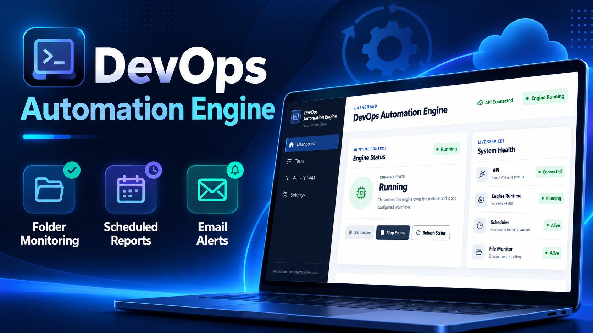

# DevOps-Style Automation Engine

A Python-based automation project developed in two stages: first as a CLI automation engine, and later as a complete full-stack local automation application.

The project focuses on automating folder monitoring, scheduled reporting, email delivery, runtime control, and activity tracking.

---

## Project Versions

### 1. CLI Version

Folder:

`1.CLI-Version`

This is the original command-line version of the automation engine.

It includes:

- CLI-based engine start, stop, and status
- Folder monitoring
- New, modified, and deleted file detection
- Daily and interval scheduling
- Folder activity reporting
- SMTP email delivery
- Logging
- Runtime status
- Safe process management
- Automated tests

For complete setup, architecture, commands, and testing information, open:

`1.CLI-Version/README.md`

---

### 2. Full-Stack Version

Folder:

`2.FullStack-Version`

This version extends the original automation engine with a FastAPI backend and React frontend.

It provides a visual interface for managing and monitoring automation workflows.

Main features include:

- React dashboard
- FastAPI backend
- Engine start / stop / status
- Monitoring job creation and management
- Native local folder selection
- Folder validation
- Daily, minute, and hourly schedules
- Continuous file monitoring
- Secure Gmail App Password storage
- Sender and receiver email configuration
- Scheduled activity reports
- Activity logs
- Last task result
- Multi-job monitoring support
- Automated backend and frontend verification

For detailed setup and usage:

Backend:

`2.FullStack-Version/backend/API_README.md`

Frontend:

`2.FullStack-Version/frontend/README.md`

---

## Main Workflow

```text
Configure Email
        ↓
Create Monitoring Job
        ↓
Select Local Folder
        ↓
Choose Report Schedule
        ↓
Start Automation Engine
        ↓
Monitor File Changes
        ↓
Generate Activity Report
        ↓
Send Report by Email

The engine can detect:

New files
Modified files
Deleted files

and automatically report those changes according to the configured schedule.

Original Project Requirements

The original project requirement document is included in this repository:

Project_Requirements_Python_Core_Engineering.pdf

This document contains the initial requirements on which the automation engine was developed.



## Repository Structure

```text
1.DevOps-Style-Automation-Engine/
│
├── README.md
├── Project_Requirements_Python_Core_Engineering.pdf
│
├── 1.CLI-Version/
│   └── README.md
│
└── 2.FullStack-Version/
    ├── backend/
    └── frontend/
```

## Technology Stack

### Core Automation

- Python
- Threading
- JSON Configuration
- SMTP
- File System Monitoring
- Scheduling
- Logging

### Full-Stack Version

- Python
- FastAPI
- React
- JavaScript
- Vite
- CSS

## More Information

Each version contains its own detailed documentation.

For CLI usage:

[`1.CLI-Version/README.md`](1.CLI-Version/README.md)

For the Full-Stack backend:

[`2.FullStack-Version/backend/API_README.md`](2.FullStack-Version/backend/API_README.md)

For the Full-Stack frontend:

[`2.FullStack-Version/frontend/README.md`](2.FullStack-Version/frontend/README.md)

## Author

**Muhammad Zeeshan**

Full-Stack Development • Python Automation • React • FastAPI
